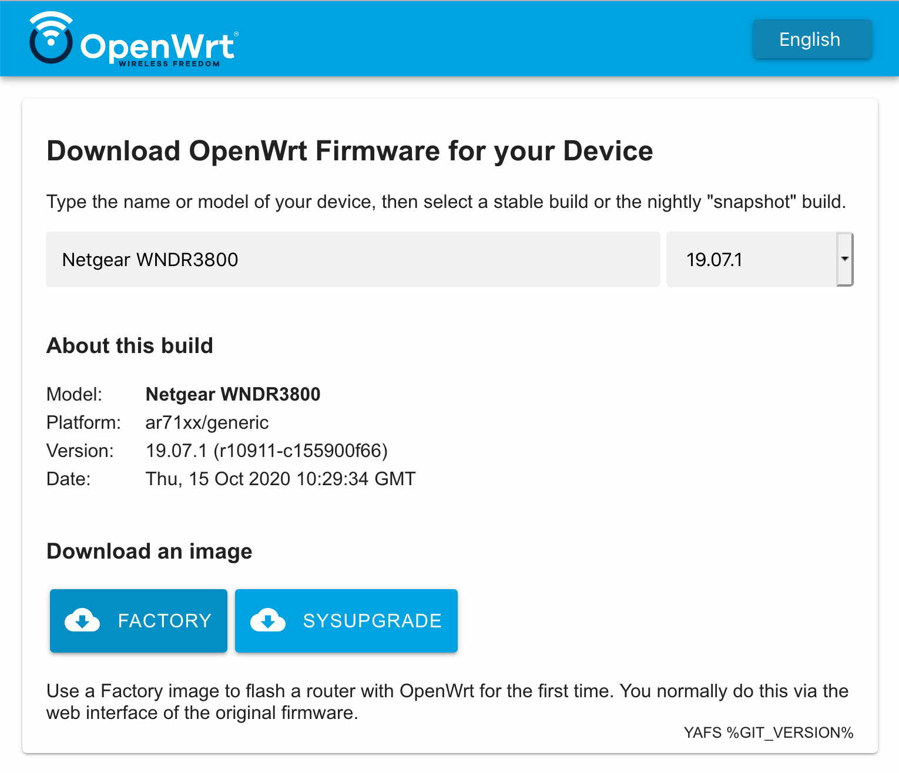

# OpenWrt Firmware Selector

A simple OpenWrt firmware selector using autocompletion. Uses plain
HTML/CSS/JavaScript. Checkout the [Demo](https://mwarning.github.io/openwrt-firmware-selector/www/).

This is a Fork/Mirror of the official [OpenWrt](https://gitlab.com/openwrt/web/firmware-selector-openwrt-org) version, but without OpenWrt specific changes like the feedback link and continuous integration scripts.



## Quick Run

* Download the sources and change the working directory
* Start webserver (e.g. `python3 -m http.server`)
* Go to [http://localhost:8000/www/](http://localhost:8000/www/) in your web browser

Configure with [config.js](www/config.js).

## Installation

Steps:

1. Place the `www/` folder somewhere web accessible.
2. Set `image_url` in `www/config.json` to where the images are located.
   Example: https://downloads.openwrt.org
3. Organize the images like on (downloads.openwrt.org)[https://downloads.openwrt.org].
   Example: https://downloads.openwrt.org/releases/23.05.4/targets/ramips/mt7621/openwrt-23.05.4-ramips-mt7621-dlink_dir-1935-a1-squashfs-sysupgrade.bin
   (path scheme is `<image_url>/releases/<version>/targets/<target>/<subtarget>/`)
4. Place a single `.versions.json` at `image_path`.
   Example: `https://downloads.openwrt.org/.versions.json`

```
{
  "stable_version": "23.05.4",
  "versions_list": ["23.05.4", "19.07.10"]
}
```

5. Place `.overview.json` files in each version folder.
   Example: `https://downloads.openwrt.org/releases/23.05.4/.overview.json`

They can be generated by this shell command:
```
for VERSION_PATH in 19.07.10/ 23.05.4/; do
	jq -s '{ release: .[0].version_number, profiles: [.[] | .target as $target | .profiles | keys[] as $k | { id: ($k), titles: (.[$k] | .titles), target: $target }] }' $(find "$VERSION_PATH" -iname 'profiles.json') > $VERSION_PATH/.overview.json
done
```

### Generate OpenWrt JSON

The `.overview.json` file for a version is created from all `profile.json` files that are generated by OpenWrt when images are created. To enable generation, go to the build settings (`make menuconfig`):
`Global build settings  ---> [*] Create JSON info files per build image`.

If the option is not available (OpenWrt 18.06 or 19.07.3), apply commit [openwrt/openwrt@881ed09](https://github.com/openwrt/openwrt/commit/881ed09ee6e23f6c224184bb7493253c4624fb9f).

## Attended SysUpgrade (ASU)

[ASU](https://github.com/openwrt/asu) is a build server that builds OpenWrt images with a given list of packages on request. The firmware-selector can be used as an interface to send these requests and to download the images when finished.

### UCI-Defaults

The Firmware Selector allows to define a script to be placed in the `/etc/uci-defaults/` folder of the OpenWrt image. These scripts are executed once on the first reboot and then deleted. See the [OpenWrt documentation](https://openwrt.org/docs/guide-developer/uci-defaults) on this topic.

## Translations

Visit [weblate.org](https://hosted.weblate.org/projects/openwrt/firmware-wizard/) to contribute new translations or to improve them.

## Similar Projects

- [Gluon Firmware Selector](https://github.com/freifunk-darmstadt/gluon-firmware-selector): For [Gluon](https://github.com/freifunk-gluon/) images, now with pictures.
- [Freifunk Hennef Firmware Downloader](https://github.com/Freifunk-Hennef/ffhef-fw-dl): Similar to the project above, but PHP based.
- [LibreMesh Chef](https://github.com/libremesh/chef/): Allows to select configurations.
- [GSoC Firmware Selector](https://github.com/sudhanshu16/openwrt-firmware-selector/): Result of the GSoC
- [FFB Firmware Selector](https://github.com/freifunk-bielefeld/firmware-selector): Build for Freifunk Bielefeld
