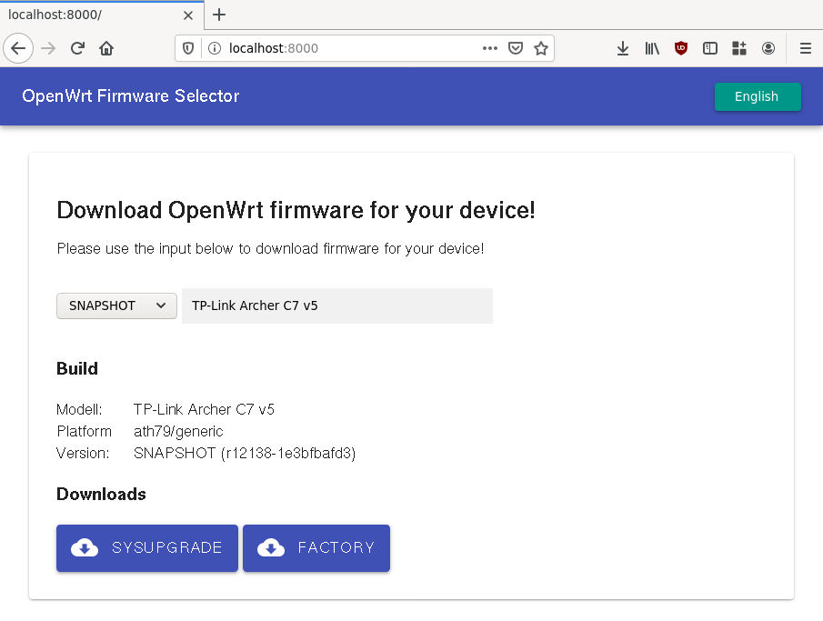

# Yet Another Firmware Selector

A simple OpenWrt firmware selector using autocompletion.

Run:

* Download repository.
* Go to the project www directory.
* Start webserver (e.g. `python3 -m http.server`)
* Go to `http://localhost:8000`

## Update Database

OpenWrt master has a feature to create json files. The included python script can merge all these files for a new data.json file: `./collect.py bin/ bin2/ > data.json`

## Contributions

It would be nice to have more features. E.g.:

* more translations
* help text for images
* better CSS
